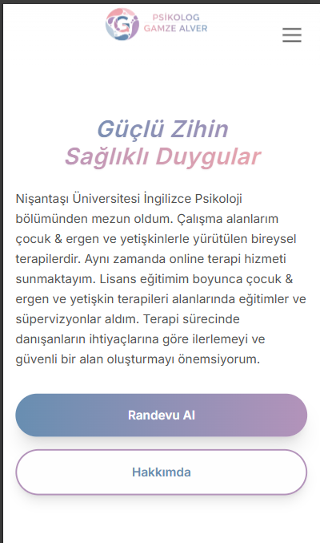
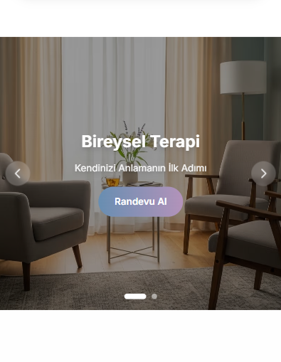
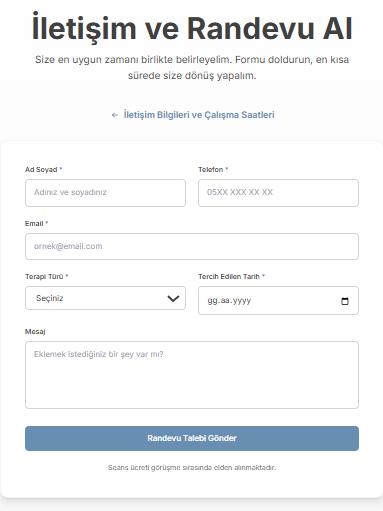
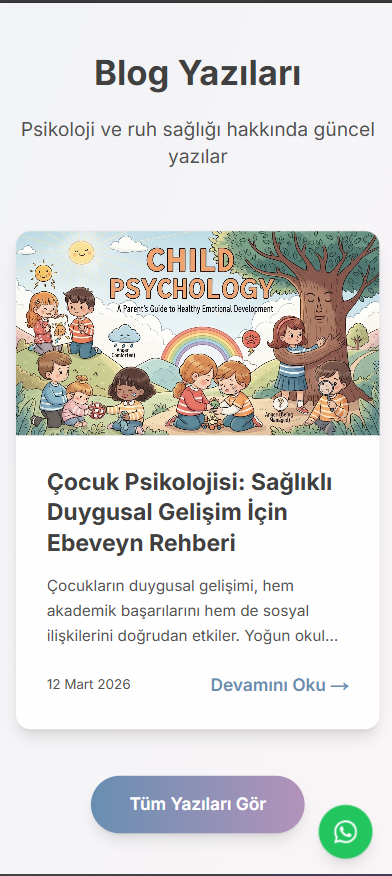

## Psychologist Website (Next.js & Supabase)

- SEO-friendly, mobile-first website built with Next.js (App Router) + TypeScript
- End-to-end appointment flow (UI + API) and blog module on Supabase (PostgreSQL)
- Row Level Security (RLS) policies and triggers; ready for deployment on Vercel

### Screenshots

Homepage:

Slider section:

Appointment form:

Blog section:

### Notes
This repository is for portfolio/demo purposes only. Source code lives in a private repository.
